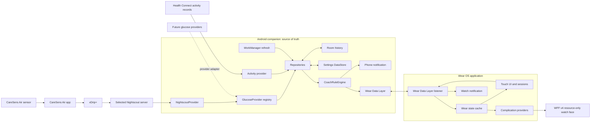

# Architecture

## Goals and boundaries

Metabolic Coach is an intervention-oriented wellness application, not a general smartwatch
dashboard. The architecture therefore optimizes for:

- one current, readable state on the wrist;
- one immediately available action;
- phone-owned integration and storage;
- touch-only operation on a round Galaxy Watch8;
- low-frequency background work and system-rendered ambient watch-face content;
- replaceable data providers and future cloud or intelligence layers;
- explicit missing/future/stale/low/fast-fall safety behavior shared by phone and Wear;
- phone-side, provider-independent glycemic planning that reports data coverage and mathematical
  scenarios without changing coaching or treatment behavior.

The watch never connects to Nightscout, a CGM, Health Connect, Samsung Health, or multiple
third-party apps directly. The phone is the data authority. The watch is a cached view and command
surface. Nightscout URLs, connectivity policy, and future credentials remain phone-only.

## System context



The Nightscout edge is the active Version 1 glucose route. The future-provider edge is an
architectural extension point, not an implemented Version 1 integration. Configuring several
Nightscout servers does not create a fallback chain: exactly one server is active and switching is
an explicit user action.

## Module dependency rule

Dependencies point inward:

```text
phone ─┬─> core:data ─> core:domain ─> core:model
       ├─> core:sync ─> core:domain ─> core:model
       └────────────────────────────> core:model

wear ──┬─> core:sync ─> core:domain ─> core:model
       └────────────────────────────> core:model

watchface -> Android resources only
```

The phone and Wear presentation layers use MVVM: Hilt-created ViewModels combine repository
`Flow`s into immutable UI state consumed by Compose. Coroutines handle I/O and one-off actions.
Repositories hide Room, DataStore, Health Connect, provider, and Data Layer details from the UI.
Hilt bindings live at infrastructure boundaries so domain code remains constructor-testable.

### `:core:model`

Pure Kotlin models define:

- normalized glucose values in mg/dL with presentation conversion to mmol/L;
- trend, delta, timestamps, provider status, and provider loading/degraded state;
- named Nightscout server entries, explicit active-server selection, and network/retry policy;
- activity snapshots, daily exercise-session count/duration aggregates, and intervention sessions;
- meal markers, daily summary, recommendations with stable IDs and validity windows, settings, and
  observations;
- Glycemic Goal Planner windows, GMI-derived metrics, target provenance, coverage/gap status, and
  low-glucose-risk scenario status;
- saved planning milestones with lifecycle, fixed target dates, deterministic ordering, selected
  detail state, and versioned calculation contracts;
- watch state, phone instance/revision metadata, session-command acknowledgements, and quick-action
  commands.

Business values remain normalized in mg/dL. Unit selection currently changes presentation; it does
not change stored threshold units.

### `:core:domain`

The domain module contains no Android dependency. It owns:

- repository interfaces;
- phone-side Nightscout settings validation, URL normalization, and stable source identity;
- deterministic coaching-rule evaluation;
- shared exercise-safety evaluation and effective-recommendation filtering;
- deterministic follow-up-reading selection;
- settings validation;
- time-weighted 14/30/60/90-day glycemic metrics and target scenarios from normalized
  `GlucoseReading` values, including source isolation, coverage/gap reporting, and low-glucose-risk
  suppression;
- cautious effect summaries and prospective-only timing observations.

This makes the most important logic fast to test on the JVM.

### `:core:data`

The data module adapts Android facilities to domain contracts:

- Room database and DAOs;
- Preferences DataStore settings;
- an asynchronous OkHttp Nightscout API client, JSON parser, bounded response size, conditional
  request support, bounded historical range backfill, per-server memory cache, bounded retry, and
  observable provider state;
- Health Connect activity readers;
- CareSens partner capability stub and an inactive Samsung Health partner-provider boundary;
- retained Health Connect glucose and xDrip adapter code as inactive future-provider boundaries;
- a bounded-memory, schema-versioned personal-data JSON exporter and local-data eraser;
- planner settings persisted in the phone DataStore, saved milestones in Room with selected-ID
  state in a separate DataStore, and both included in the user-owned JSON export;
- repository implementations and Hilt multibindings for the normalized `GlucoseProvider`
  interface.

Version 1 provider policy always resolves persisted legacy modes to Nightscout. Neither debug nor
release manifests register the xDrip broadcast receiver. Direct CareSens communication, Bluetooth
reverse engineering, private-app storage access, and undocumented IPC are intentionally absent.

Nightscout retrieval uses `GET /api/v1/entries/sgv.json?count=300`. Parsed values are normalized to
`GlucoseReading`; trend comes from Nightscout direction, while delta and rate are calculated from
ordered readings. Source IDs include the configured server ID and a digest of its normalized URL,
so histories and caches cannot be mixed when servers change. The provider publishes loading,
available, configuration-required, or degraded state through `Flow`. A degraded state can carry
the newest cached reading while Room remains the durable history.

When the phone requests a recent historical window (up to 90 days) and the provider cache is cold,
Nightscout history is fetched in bounded seven-day ranges using `find[dateString][$gte]`,
`find[dateString][$lte]`, and a capped entry count. Ranges are retried independently and merged by stable
reading ID. The process-memory cache is bounded to the 90-day planner lookback plus a one-day
interpolation cushion; Room remains the durable history. The planner then computes
elapsed-time-weighted means and range exposure from one
exact source; gaps beyond the interpolation limit reduce coverage instead of being silently
filled. This backfill is a phone-side data operation and is not sent through Wear.

The current authenticator is deliberately a no-op for public Nightscout servers. A separate
`NightscoutRequestAuthenticator` boundary exists for future credential-backed requests.
Credentials are invalid inside a URL and must eventually use a phone-only secure credential store;
they must never enter ordinary DataStore settings, logs, exports, or Wear synchronization.

Room is currently at schema version 9. Exported schemas 1–9 are committed under
`core/data/schemas/`; migrations 1→2 add follow-up lifecycle fields, 2→3 add query indices, 3→4 add
exact baseline/follow-up reading provenance plus the last presented recommendation ID, and 4→5 add
daily exercise-session count/duration with safe zero defaults. Migration 5→6 adds nullable
recommendation, trigger, baseline-rate, and low-threshold-at-start provenance so legacy rows are not
retrospectively classified as prospective timing samples. Migration 6→7 adds immutable,
phone-authored recommendation snapshots used to validate delayed watch commands. Migration 7→8
adds the phone-only `glycemic_planning_milestones` table and lifecycle/date indexes. Migration 8→9
adds the history-management tables described below. The `DatabaseMigrationTest` instrumentation
source covers 1→9 plus every supported starting version 2–8, and the build pipeline compiles that
source. The suite has not executed; doing so still
requires an Android device or emulator. Every future version must add both a migration and its
exported schema.

### `:core:sync`

The sync module owns a versioned `DataMap` codec and the `/metabolic/v1` path namespace:

- `/metabolic/v1/current` — latest phone-generated watch state;
- `/metabolic/v1/action/{uuid}` — watch-to-phone command;
- deletion of the action data item — terminal transport handling.

State includes normalized glucose, activity, recommendation, coaching settings, phone battery,
active intervention, generation time, a persistent phone-instance ID, a monotonically increasing
publication revision, the current terminal session-command acknowledgement, and an optional durable
data-reset token. It does not include Nightscout URLs, server choices, timeout/retry settings, or
credentials. Unknown schema versions are rejected. Commands and intervention sessions use UUIDs.
Watch commands echo the current reset token; after an erase, a missing or older token is terminally
rejected so an offline queued action cannot recreate deleted history. Before deleting a terminal
command data item, the phone persists `APPLIED`,
`REJECTED_EXPIRED`, `REJECTED_UNSAFE`, or `REJECTED_CONFLICT`, retains a bounded replay history for
the maximum supported command lifetime, and awaits durable WorkManager enqueue. A replayed terminal
command triggers required watch-state republication without invoking business mutation again.
Required state delivery retries until publication succeeds.

A completion received before its start remains deferred. The processor rechecks deferred commands
on new input and on a periodic lease. If the prerequisite start was terminally rejected, the
completion inherits that outcome so the Wear tombstone can converge. Publication ordering keeps a
completion acknowledgement from being overwritten by a replayed start for the same session.
The generic command-age limit applies to starts and snoozes. A delayed completion for a session
already known to the phone still records the original completion time; an expired completion whose
session never arrived is terminally rejected instead of remaining deferred forever.
For a coached start, the phone requires the immutable recommendation snapshot it authored before
publication. A missing snapshot is expired, and any optional recommendation fields echoed by the
watch must match or the command conflicts. The phone validates the recorded action instant against
the snapshot's creation-inclusive, validity-exclusive window and evaluates safety from the selected
provider's reading at or before that instant. Delivery latency therefore cannot erase an activity
that the watch accepted while the recommendation and glucose context were valid. The separate
configurable generic age limit still bounds how long an unprocessed start or snooze may remain
actionable.

`DataItem` is used because the state should survive temporary disconnection and synchronize when
the phone and watch reconnect. Current state and user actions are marked urgent. The phone and Wear
APK must have the same application ID and signing identity; Google Play services enforces that
boundary. See the official [Data Layer overview](https://developer.android.com/training/wearables/data/overview).

The Wear app persists the last successfully decoded state and a session replica. The replica
contains the active local session, pending command/mutation, transport status, completion
tombstone, and reconciliation message. This allows complications to render after restart and
prevents an older phone state from erasing an unacknowledged local start or reviving a locally
completed session. A separate bounded DataStore outbox accepts generic non-session commands,
currently including snooze, deduplicates them by stable command ID, preserves deterministic order,
and retries until the command is accepted by Data Layer. The phone's bounded terminal history
prevents a replayed outbox/Data Layer item from applying its business mutation twice.
When Wear first accepts a new non-null data-reset token, it clears the session replica and generic
command outbox before caching the empty phone state. Replaying the same token is idempotent.

## Runtime flows

### Glycemic Goal Planner

The planner is a phone-only read path layered above `GlucoseRepository`. It requests up to 90 days
of normalized Nightscout readings, computes 14/30/60/90-day rolling metrics with time weighting,
uses the 14-day window as a safety baseline and displays 30/60/90-day rolling metrics, then
converts mean glucose to the published GMI estimate (`GMI = 3.31 + 0.02392 × mean mg/dL`). The
inverse equation is used only to show a mathematical future mean for a selected target. For a
30-day horizon the scenario uses the preceding 60-day observed mean; for 60 days it uses the
preceding 30-day mean; for 90 days it targets the full-window mean directly. Insufficient coverage,
source changes, long gaps, invalid input, and configured low/very-low exposure suppress or qualify
the result. Planner output is display-only and does not enter coaching, notifications, Wear state,
or watch-face complications in `v0.4`; the v0.4.1 freshness fix and v0.4.2 milestones preserve
that boundary.

Saved planning milestones are layered above the same calculation boundary. Each row stores one
canonical target GMI, provenance, original horizon, fixed target date, lifecycle state, and
calculation-contract version. The repository migrates the old singleton target once into a stable
row and keeps selected-ID/migration-notice presentation state separate from Room. Before a target
date, the selected milestone uses the actual remaining days in its fixed horizon; at or after the
date it evaluates the fixed 90-day window ending at that date. Active future/due, active past, and
archived rows use deterministic ordering. Due/past rows cannot change target/date/horizon, and no
milestone is auto-completed or sent to Wear/coaching/notifications. This is the `v0.4.2`
phone-only extension of the planner, not a new glucose or intervention pipeline.

Migration 8→9 adds `glucose_history_settings` and the source-scoped
`glucose_history_backfill_state` checkpoint table. `GlucoseHistoryRepository` owns explicit
retention confirmation, transactional source-scoped pruning, and one bounded historical range at a
time. It calls the provider's range capability but never writes the current-state pointer or emits
Wear data. A persisted running checkpoint is presented as paused after process interruption so the
user can safely resume it. The normal refresh remains the existing current-first 90-day path.

The v0.5.0 history card is phone-only. It exposes local row count/date range and retention/backfill
state, while Android backup rules continue to exclude raw history from cloud backup and device
transfer.

The v0.5.1 phone History destination is a read-only presentation path over that store. It captures
one source identity and one immutable UTC half-open interval, then calls only
`GlucoseRepository.readingsBetweenExactSource`. Its loader has no provider, refresh, or backfill
dependency. A request-generation gate prevents results from an older period, an old source, or a
hidden History screen from publishing.

`HistoryRangeResolver` owns rolling and local-calendar semantics. Custom selections contain 14–90
completed local days and are converted once through the device time zone, including daylight-
saving transitions. `GlucoseTrendSeriesBuilder` orders and de-duplicates deterministically, leaves
gaps over 20 minutes disconnected, and bounds render buckets while preserving extrema and time-
weighted values. `SelectedPeriodGmiCalculator` reuses the accepted planner metrics contract. Only
the last fixed presentation preset is stored in DataStore; there is no Room schema migration and
no Wear, coaching, notification, or current-reading consumer.

### Refresh and coaching

1. After the user configures and selects a Nightscout server, the phone schedules unique periodic
   WorkManager work with connected-network constraints at the configured polling interval.
   WorkManager enforces a 15-minute minimum and execution remains inexact. Foreground manual
   refresh calls the refresh coordinator directly; startup, settings/meal changes, and quick
   actions can also request refresh.
2. Nightscout glucose and Health Connect activity refresh concurrently. Missing Health Connect
   background access does not cancel Nightscout work; activity can degrade independently.
3. `NightscoutProvider` loads only the explicitly active server. It makes a cancellable asynchronous
   current-entry request without a conditional validator, parses up to 300 recent entries, and
   publishes provider state without blocking the UI. Historical range requests remain best effort;
   an unexpected `304` or failed range cannot replace the current cache pointer.
4. Transport failures, HTTP 408/429, and server 5xx responses receive bounded exponential retry
   using the configured base interval and maximum attempts, with every delay capped at 60 seconds.
   Authentication/configuration/client errors and invalid JSON are not retried. On final failure,
   per-server memory cache and durable Room history are retained; the provider reports
   degraded/error state instead of fabricating a reading.
5. Repositories persist normalized data under the active server's exact source ID. Selecting a
   different configured server immediately changes the queried source. No automatic failover,
   history merge, or cache sharing occurs.
6. `CoachRuleEngine` consumes only normalized `GlucoseReading` values and user settings. It has no
   Nightscout dependency. Its recommendation flow also reevaluates at minute boundaries so expiry
   and quiet-hour transitions do not depend on a new provider record.
7. Before publishing an action, the phone inserts its complete recommendation snapshot if absent
   and reads back that canonical immutable value. A retry with the same stable ID publishes the
   original snapshot rather than regenerated timestamps or dose fields.
8. The worker publishes a provider-agnostic `WatchState`.
9. A successful persistent watch-state publication is the canonical coaching-prompt delivery and
   is counted using the stable recommendation ID. If notification permission is available, the
   phone also posts an optional local mirror with a timeout bounded by the recommendation validity
   window.
10. The Wear listener caches accepted revisioned state, reconciles session acknowledgement,
    refreshes all complications, and may post a watch notification. Wear also reevaluates action
    validity, quiet hours, active-session state, and shared glucose safety at minute boundaries.

Periodic WorkManager execution is inexact and can be deferred by the operating system. A
15-minute schedule is not proof of 15-minute end-to-end CGM freshness.

### Watch quick action

1. A large Wear button, watch notification, or coach complication creates a `QuickActionCommand`.
2. Wear validates the local request and resolves each invocation to an explicit `QUEUED` or
   `REJECTED` policy result. Notification and complication entry points display that terminal
   result through `QuickActionActivity`; accepted in-app session actions transition into the
   session UI. A queued result means durable local/Data Layer work, not yet phone-authoritative
   application.
3. Start/completion writes a pending local session replica immediately for responsive feedback and
   process-death persistence. Snooze enters the generic durable outbox and suppresses the displayed
   recommendation locally while delivery retries.
4. The start command is stored as an urgent Data Layer item. Completion cannot be queued until the
   pending start has reached Data Layer; completion then clears the local active session and leaves
   a tombstone until the phone responds.
5. The phone checks terminal command history before any mutation. It applies new start/complete
   commands idempotently using the stable session ID and applies snooze once; replayed command IDs
   are acknowledged without applying business state again. A coached start must resolve to the
   immutable phone-authored recommendation snapshot; missing or conflicting provenance is rejected.
   Validity and glucose safety are checked at the recorded action instant rather than the later Data
   Layer receipt time.
6. If completion arrives before its start, the processor defers it and retries after earlier
   commands/state arrive instead of creating a contradictory session. Once the phone knows the
   session, its completion remains valid across a long offline interval; an expired orphan
   completion is terminally rejected.
7. The phone persists a terminal outcome for every command. Session outcomes are published with
   phone-authoritative state so Wear clears pending/tombstone data on `APPLIED`, or adopts that state
   with an explanatory expired, unsafe, or conflict result. Generic commands use the same replay
   history. Only terminally handled command items are deleted.
8. Within one phone-instance epoch, Wear accepts only a higher state revision. A new phone-instance
   ID starts a new revision epoch. Legacy unrevisioned state is accepted only when neither a pending
   mutation nor a current revision exists.
9. A completed session schedules a configurable follow-up observation.

At session start, the baseline is the selected provider's newest reading within the configured
freshness window ending at the command time; value, reading ID, measurement time, and exact source
ID are stored. For a coached action, complete provenance also records the recommendation ID, reason,
algorithm version, creation/validity times, trigger context ID/time, intervention type and
duration/floor dose from the phone-authored snapshot, baseline effective rate, and low-glucose
threshold at start. Watch-echoed fields are consistency hints, never the authority for session
dose or provenance. Manual or legacy sessions do not invent missing recommendation provenance.

At the configured due time, follow-up work refreshes glucose and queries only that exact source
within the bounded due-time window. It immediately selects a deterministic at/after-due reading,
waits until the deadline when only earlier readings exist, and then deterministically falls back to
the closest exact-source reading. The exact follow-up due time, value, reading ID, measurement time,
source ID, and finalization time are stored; if no candidate is available by the deadline, the
follow-up finalizes as missing. Pending follow-ups are rescheduled after process restart. The
lifecycle remains eventually consistent and still requires physical disconnect, reconnect,
process-death, and reboot testing.

### Health data

Version 1 glucose is read from Nightscout, not Health Connect. The phone uses Health Connect for:

- daily aggregate `StepsRecord`, `FloorsClimbedRecord`, and `ActiveCaloriesBurnedRecord`;
- latest `HeartRateRecord`;
- all valid `ExerciseSessionRecord` entries for today's session count, total duration, and latest
  exercise end time;
- latest step or exercise end time to estimate last movement.

It stores only daily exercise-session count/duration aggregates, not detailed per-session workout
history, exercise type, or route. The inactive Health Connect glucose adapter remains isolated
behind `GlucoseProvider` for possible future use, but Version 1 provider policy does not select it.
`v0.6.2` consumes the already persisted `ActivitySnapshot`; it adds no Health Connect query,
provider behavior, polling cadence, WorkManager job, or background wake.

Foreground reads require the record permissions selected by the user. Background reads are
requested only when the device reports
`FEATURE_READ_HEALTH_DATA_IN_BACKGROUND`. Unsupported or denied background activity access
therefore degrades to foreground/manual activity refresh without disabling Nightscout glucose
polling.

## Coaching decision order

`CoachRuleEngine` is intentionally deterministic. Higher-priority gates stop lower-priority
actions:

1. missing, future-dated, or stale glucose information;
2. glucose below the configured low threshold;
3. glucose falling at or faster than the configured exercise-pause rate;
4. select one candidate: post-meal walk, then confirmed rapid-rise walk, then working-hours
   inactivity;
5. notifications disabled or quiet hours;
6. active snooze;
7. cooldown or daily notification limit.

`v0.6.2` enables prolonged-inactivity coaching as a WALK-only third-priority candidate. A pure
`InactivityConfirmationPolicy` requires a nonblank activity source, internally consistent
same-day timestamps, current working hours, enabled walking reminders, and an exact-threshold or
greater inactivity duration. Missing, future, previous-day/cross-midnight, inconsistent, or stale
activity fails closed. The existing `staleReadingMinutes` bound is also the conservative activity
freshness ceiling for this milestone; its default and range are unchanged. Stair settings have no
effect on automated inactivity coaching, and automated stairs remain disabled.

All user-facing coaching durations, thresholds, time windows, daily limits, enablement switches,
units, and observation sample counts are represented in `CoachSettings` and persisted by the phone.
One shared `CoachSettingsBounds` contract supplies both validator and phone controls, including the
full valid ranges; quiet/working-hour editors preserve exact minutes. Defaults are starting values,
not medical recommendations. The exercise-pause fall-rate setting accepts 0.5–10.0 mg/dL/minute and
defaults to 2.0 mg/dL/minute.

Every action has a deterministic ID, creation time, and `validUntilEpochMillis`. Rapid-rise
confirmation uses the current reading and its immediate predecessor in exact-source deterministic
order. Their IDs must differ, timestamps must increase strictly, their gap must not exceed the
configured stale-reading window, and both normalized effective rates (`rate`, otherwise trend
fallback) must meet the configured rapid-rise threshold. Missing local history, timestamp ties,
cross-source pairs, or a nonqualifying reading fail closed without a provider request.

The rapid algorithm-v3 identity is a bounded SHA-256 fingerprint of the source, both reading
IDs/timestamps, and algorithm version. Post-meal keeps its algorithm-v2 meal/source identity.
Inactivity uses an algorithm-v4 SHA-256 episode identity derived from reason, activity source,
last-movement timestamp, threshold crossing, and algorithm version. Glucose IDs/timestamps,
activity refresh time, current time, and step/floor totals do not change that identity. The
persisted snapshot for one episode remains immutable and cannot gain a later expiry after refresh.

Rapid actions expire when glucose becomes stale; post-meal expires at the earlier of glucose
staleness and the meal-window end; inactivity expires at the earlier of glucose freshness and
activity-snapshot freshness. Phone and Wear hide a cached action during quiet hours, when
notifications are disabled, outside working hours for inactivity, while a session is active, or
whenever shared exercise safety is not `SAFE`. Complete source/trigger/safety provenance is
required. Rapid additionally stops being current when a newer reading replaces its confirmed pair;
inactivity stops being current after new movement, activity-source/settings mismatch, invalid
activity context, or an episode-identity change. Phone Start rechecks the latest persisted activity
context at processing time. Wear consumes the existing `ActivitySnapshot` and recommendation
provenance; no Wear Data Layer field or schema was added.

The coordinator remains the canonical publication authority. A synthesized inactivity candidate is
not eligible for the phone card until its immutable snapshot is stored and the successful
publication is recorded. The same effective action is then mirrored to Watch state and the optional
phone notification. Notification and complication display lifetimes end at the earliest of the
immutable action validity, the next quiet-hours start, or—for inactivity—the working-hours end.

## Watch and watch-face design

The Wear app uses Material 3 for Wear and large touch targets. A touch-driven three-page
`HorizontalPager` provides coach/home, quick actions, and Today pages. It uses horizontal swipes,
taps, long press for trend detail, scrolling, and buttons; no path depends on bezel rotation.
Phone and Wear apply the synchronized system/dark/high-contrast theme and configured font scale.
Motion is deliberately minimal: system pager movement plus an animated return to Home when a
session starts. Decorative and ambient animation are avoided; smoothness and power behavior remain
physical-Galaxy-Watch8 acceptance items. An active walk shows a one-second countdown on Home and the
session screen, displays completion at zero, and emits one completion haptic.

The face is WFF v4 with `android:hasCode="false"` and `minSdk = 36`. WFF is declarative, so the face
does not execute Compose or coaching logic. It contains fixed complication slots backed by the
Wear app:

- glucose, trend, delta, and age;
- steps and floors;
- actionable coach prompt;
- system watch battery and clock.

Ambient mode removes decorative surfaces, activity, coach action, and battery while retaining a
thin clock and glucose text. Long-press and general swipe behavior on a WFF face belong to the Wear
OS system; actionable behavior is supplied through complication tap actions. WFF
`ColorConfiguration` supplies metabolic, white, and cyan accent choices independently of the
Compose theme.

Google requires WFF logic and Wear application logic in separate bundles:
[WFF setup](https://developer.android.com/training/wearables/wff/setup).

## Storage and deletion

| Store | Device | Data |
| --- | --- | --- |
| Room | Phone | Glucose readings, activity snapshots, intervention sessions, meal markers, coaching state, and saved planning milestones |
| Preferences DataStore | Phone | Coaching/presentation settings, legacy planner target/safety settings, selected planning-milestone ID and migration notice, and persistent phone instance, publication revision, data-reset token, and terminal command acknowledgement/history |
| Preferences DataStore | Watch | Latest encoded watch state, active/pending session replica and completion tombstone, plus the bounded generic command outbox |
| Data Layer | Google Play services | Latest synchronized state and transient action items |

Android backup is disabled in both application manifests. There is no cloud account or project
backend. Wear Data Layer traffic can use Bluetooth or Google infrastructure and is end-to-end
encrypted according to the platform documentation. See [Privacy and safety](PRIVACY_AND_SAFETY.md).

The phone Settings screen can stream a schema-versioned JSON export through Android's document
picker. It contains coaching settings, planner settings, selected milestone state, and every row from the seven application
Room tables in stable table/row/property order; Nightscout connection configuration and future
credentials are excluded.
The writer emits one database row at a time and does not create an extra temporary health-data copy.

Export and confirmed erase share a process-wide `PhoneDataMutationGate` with provider refresh and
ingestion, follow-up finalization, phone/watch quick actions, meal/settings writes, and state
publication. Slow provider work is registered as preemptible: an ordinary command, settings write,
export, or erase cancels its child coroutine before taking the same gate, while the provider's
cancellable request and any accepted database write still cannot cross the boundary. The export
therefore observes a consistent local snapshot, and a writer cannot straddle the local deletion
transaction. Erase best-effort cancels periodic/immediate refresh and all known/tagged follow-up
work, rotates the phone instance and reset token, drains deferred watch commands, clears every Room
table, the entire settings DataStore, the local prompt, and provider process-memory caches, then
publishes an empty revisioned watch state. The reset token remains in all later publications, so an
offline watch eventually clears when it reconnects. Source records and permissions are outside
this boundary, and normal use can collect new source data after erase.

## Extension patterns

### Add a glucose provider

1. Implement `GlucoseProvider`.
2. Normalize data into `GlucoseReading`, preserving measured and received timestamps and a stable,
   exact provider source ID.
3. Add explicit configuration, authorization, status, and provider-state behavior without leaking
   provider types into the coaching or sync modules.
4. Bind it into the Hilt `Set<GlucoseProvider>` registry and update the explicit provider-selection
   policy.
5. Keep provider settings and secrets phone-only. Add a secure credential adapter if authentication
   is required; do not store secrets in ordinary DataStore or URLs.
6. Add parsing, network-failure, retry, cache isolation, switching, stale-data, duplicate,
   timezone, and ordering tests using synthetic fixtures.
7. Add a user-visible source/authorization explanation and an explicit migration path.

Do not add direct sensor BLE, private-storage scraping, accessibility scraping, or undocumented
vendor IPC.

### Add Samsung Health Data SDK

Add an adapter behind the existing activity/repository boundary. Keep the downloaded AAR and
partner credentials out of source control, gate its use by authorization status, and retain Health
Connect as a separate provider. See [Integrations](INTEGRATIONS.md).

### Add cloud synchronization

Keep Room as the local source of truth. Add an outbox/change-token boundary in `:core:data` and a
network implementation in a new infrastructure module. Do not route the watch directly to several
third-party services.

### Phase 3 personal observations

Activity-effect summaries use only completed, finalized outcomes with distinct baseline/follow-up
reading IDs, valid chronology, exact timestamps, matching source IDs, and the low-glucose threshold
captured at session start. Follow-ups below that captured threshold and pre-v6 rows without the
threshold provenance are excluded. Current manual sessions still qualify for effect summaries when
their complete safety and outcome provenance is present. They report a median recorded change after
the configured minimum sample count.

Timing analysis is prospective-only: it accepts no legacy or manual session unless complete
recommendation and trigger provenance was captured when the coached action started. Generic
trigger-to-start delays use configurable buckets with a conservative 5-minute default; post-meal
delays use configurable buckets with a conservative 15-minute default. A bucket must contain at
least `max(minimumObservationSamples, minimumTimingBucketSamples)` eligible sessions; the timing
sample default is eight. The configured number of comparable timing buckets must exist inside one
matched cohort; its default is two. A timing result is emitted only when one bucket has the unique
lowest observed median and its upper quartile is below every comparator bucket's lower quartile.

The cohort key holds intervention type, recommendation reason and algorithm version, exact glucose
source, configured duration/floor dose, planned follow-up delay, a configurable
actual-follow-up-delay bucket (15-minute default), a configurable baseline glucose band (20 mg/dL
default), baseline rate direction, and low-glucose threshold value captured at start.
Repeated actions from the same reason/algorithm/type/trigger context are deduplicated.

Eligibility excludes incomplete or mixed-source provenance, invalid chronology, a reused baseline
and follow-up reading, overlapping intervention sessions, recorded meals during the outcome window,
additional recorded meals after the trigger, follow-up glucose below the threshold captured at
start, missing post-meal markers, and recommendation provenance whose validity does not cover
session start. Medication, unrecorded meals or activity, adherence, and self-selection remain
uncontrolled confounders.

Results are display-only observations. They do not update settings, thresholds, rule priority,
recommendation timing, or any other coaching behavior. Copy must remain observational and must not
describe a timing bucket as medically recommended, causal, best, or ideal.

## Known architectural release gaps

- The user accepted the configured Nightscout route through the phone for current state, retry,
  and offline-cache behavior on 2026-08-01. Extended outages, server upgrades, authentication
  changes, phone lifecycle events, and measured sensor-to-watch latency remain unverified.
- Version 1 supports public Nightscout endpoints only. The authenticator boundary is present, but
  secure credential storage and a user-facing authentication flow are future work.
- Multiple Nightscout servers require explicit selection. There is intentionally no health-data
  failover, availability probing, or automatic server switch.
- Allowing HTTP is an explicit local/test escape hatch. The manifest permits cleartext so that
  setting can function, which makes HTTPS enforcement and release security testing essential.
- Health Connect activity permission/feature gating and foreground fallback are implemented, but
  target-phone background behavior and provider latency still require lifecycle testing.
- The Samsung Health partner-provider boundary is inactive because the partner SDK, approval,
  package registration, and release-certificate registration are not available.
- Direct CareSens, xDrip broadcast, Health Connect glucose, Dexcom, and Libre providers are inactive
  in Version 1. Persisted legacy provider modes are migrated to Nightscout, and no xDrip receiver is
  registered.
- Watch action and follow-up recovery still require physical disconnect/reconnect, process-death,
  and reboot validation.
- Prospective timing excludes recorded intervening meals and overlapping intervention sessions,
  but medication, unrecorded behavior, adherence, and selection bias remain uncontrolled.
- No cloud backup, account recovery, or configurable retention policy exists. The local JSON
  export and confirmed erase flows still require device/document-provider lifecycle testing.
- The user reported the `v0.3` Galaxy Watch8 physical acceptance complete on 2026-08-02; the
  repository retains only a privacy-sanitized record, so independent device logs, extended battery
  measurements, and lifecycle retests remain unverified.
- The migration instrumentation suite has only compiled; no instrumentation execution or
  production-signed/store-policy release has been completed.
