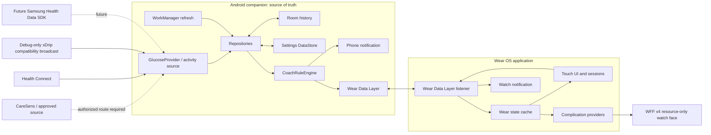

# Architecture

## Goals and boundaries

Metabolic Coach is an intervention-oriented wellness application, not a general smartwatch
dashboard. The architecture therefore optimizes for:

- one current, readable state on the wrist;
- one immediately available action;
- phone-owned integration and storage;
- touch-only operation on a round Galaxy Watch8;
- low-frequency background work and system-rendered ambient watch-face content;
- replaceable data providers and future cloud or intelligence layers;
- explicit missing/future/stale/low/fast-fall safety behavior shared by phone and Wear.

The watch never connects to CGM, Health Connect, Samsung Health, or multiple third-party apps
directly. The phone is the data authority. The watch is a cached view and command surface.

## System context



Dashed edges are architectural extension points, not implemented production integrations.

## Module dependency rule

Dependencies point inward:

```text
phone ─┬─> core:data ─> core:domain ─> core:model
       ├─> core:sync ─> core:domain ─> core:model
       └────────────────────────────> core:model

wear ──┬─> core:sync ─> core:domain ─> core:model
       └────────────────────────────> core:model

watchface -> Android resources only
```

The phone and Wear presentation layers use MVVM: Hilt-created ViewModels combine repository
`Flow`s into immutable UI state consumed by Compose. Coroutines handle I/O and one-off actions.
Repositories hide Room, DataStore, Health Connect, provider, and Data Layer details from the UI.
Hilt bindings live at infrastructure boundaries so domain code remains constructor-testable.

### `:core:model`

Pure Kotlin models define:

- normalized glucose values in mg/dL with presentation conversion to mmol/L;
- trend, delta, timestamps, and provider status;
- activity snapshots, daily exercise-session count/duration aggregates, and intervention sessions;
- meal markers, daily summary, recommendations with stable IDs and validity windows, settings, and
  observations;
- watch state, phone instance/revision metadata, session-command acknowledgements, and quick-action
  commands.

Business values remain normalized in mg/dL. Unit selection currently changes presentation; it does
not change stored threshold units.

### `:core:domain`

The domain module contains no Android dependency. It owns:

- repository interfaces;
- deterministic coaching-rule evaluation;
- shared exercise-safety evaluation and effective-recommendation filtering;
- deterministic follow-up-reading selection;
- settings validation;
- cautious effect summaries and prospective-only timing observations.

This makes the most important logic fast to test on the JVM.

### `:core:data`

The data module adapts Android facilities to domain contracts:

- Room database and DAOs;
- Preferences DataStore settings;
- Health Connect glucose and activity readers plus explicit glucose-writer discovery and pinning;
- CareSens partner capability stub and an inactive Samsung Health partner-provider boundary;
- xDrip broadcast validation and ingestion code, exposed through an exported receiver only in the
  debug phone variant;
- a bounded-memory, schema-versioned personal-data JSON exporter and local-data eraser;
- repository implementations and Hilt bindings.

Room is currently at schema version 7. Exported schemas 1–7 are committed under
`core/data/schemas/`; migrations 1→2 add follow-up lifecycle fields, 2→3 add query indices, 3→4 add
exact baseline/follow-up reading provenance plus the last presented recommendation ID, and 4→5 add
daily exercise-session count/duration with safe zero defaults. Migration 5→6 adds nullable
recommendation, trigger, baseline-rate, and low-threshold-at-start provenance so legacy rows are not
retrospectively classified as prospective timing samples. Migration 6→7 adds immutable,
phone-authored recommendation snapshots used to validate delayed watch commands. The
`DatabaseMigrationTest` instrumentation source covers 1→7 plus every supported starting version
2–6, and the build pipeline compiles that source. The suite has not executed; doing so still
requires an Android device or emulator. Every future version must add both a migration and its
exported schema.

### `:core:sync`

The sync module owns a versioned `DataMap` codec and the `/metabolic/v1` path namespace:

- `/metabolic/v1/current` — latest phone-generated watch state;
- `/metabolic/v1/action/{uuid}` — watch-to-phone command;
- deletion of the action data item — terminal transport handling.

State includes glucose, activity, recommendation, settings (including the selected Health Connect
glucose-writer package), phone battery, active intervention, generation time, a persistent
phone-instance ID, a monotonically increasing publication revision, the current terminal
session-command acknowledgement, and an optional durable data-reset token. Unknown schema versions
are rejected. Commands and intervention sessions use UUIDs. Watch commands echo the current reset
token; after an erase, a missing or older token is terminally rejected so an offline queued action
cannot recreate deleted history. Before deleting a terminal command data item, the phone persists `APPLIED`,
`REJECTED_EXPIRED`, `REJECTED_UNSAFE`, or `REJECTED_CONFLICT`, retains a bounded replay history for
the maximum supported command lifetime, and awaits durable WorkManager enqueue. A replayed terminal
command triggers required watch-state republication without invoking business mutation again.
Required state delivery retries until publication succeeds.

A completion received before its start remains deferred. The processor rechecks deferred commands
on new input and on a periodic lease. If the prerequisite start was terminally rejected, the
completion inherits that outcome so the Wear tombstone can converge. Publication ordering keeps a
completion acknowledgement from being overwritten by a replayed start for the same session.
The generic command-age limit applies to starts and snoozes. A delayed completion for a session
already known to the phone still records the original completion time; an expired completion whose
session never arrived is terminally rejected instead of remaining deferred forever.
For a coached start, the phone requires the immutable recommendation snapshot it authored before
publication. A missing snapshot is expired, and any optional recommendation fields echoed by the
watch must match or the command conflicts. The phone validates the recorded action instant against
the snapshot's creation-inclusive, validity-exclusive window and evaluates safety from the selected
provider's reading at or before that instant. Delivery latency therefore cannot erase an activity
that the watch accepted while the recommendation and glucose context were valid. The separate
configurable generic age limit still bounds how long an unprocessed start or snooze may remain
actionable.

`DataItem` is used because the state should survive temporary disconnection and synchronize when
the phone and watch reconnect. Current state and user actions are marked urgent. The phone and Wear
APK must have the same application ID and signing identity; Google Play services enforces that
boundary. See the official [Data Layer overview](https://developer.android.com/training/wearables/data/overview).

The Wear app persists the last successfully decoded state and a session replica. The replica
contains the active local session, pending command/mutation, transport status, completion
tombstone, and reconciliation message. This allows complications to render after restart and
prevents an older phone state from erasing an unacknowledged local start or reviving a locally
completed session. A separate bounded DataStore outbox accepts generic non-session commands,
currently including snooze, deduplicates them by stable command ID, preserves deterministic order,
and retries until the command is accepted by Data Layer. The phone's bounded terminal history
prevents a replayed outbox/Data Layer item from applying its business mutation twice.
When Wear first accepts a new non-null data-reset token, it clears the session replica and generic
command outbox before caching the empty phone state. Replaying the same token is idempotent.

## Runtime flows

### Refresh and coaching

1. When Health Connect reports and grants background-read support, the phone schedules unique
   periodic WorkManager work at a 15-minute interval. Otherwise it cancels that periodic work.
   Foreground manual refresh calls the refresh coordinator directly; startup, settings/meal
   changes, debug-only xDrip ingestion, and quick actions can also request refresh.
2. Glucose and activity refresh concurrently.
3. For Health Connect glucose, the phone groups the last 24 hours by writer package. Exactly one
   writer is saved automatically. Multiple writers with no saved choice produce
   `CONFIGURATION_REQUIRED` and no selected glucose; a saved package remains pinned even when it
   temporarily has no recent records. Only the selected exact source enters glucose history.
4. Repositories persist normalized selected data.
5. `CoachRuleEngine` evaluates current state and user settings. Its recommendation flow also
   reevaluates at minute boundaries so expiry and quiet-hour transitions do not depend on a new
   provider record.
6. Before publishing an action, the phone inserts its complete recommendation snapshot if absent
   and reads back that canonical immutable value. A retry with the same stable ID publishes the
   original snapshot rather than regenerated timestamps or dose fields.
7. The worker publishes a `WatchState`.
8. A successful persistent watch-state publication is the canonical coaching-prompt delivery and
   is counted using the stable recommendation ID. If notification permission is available, the
   phone also posts an optional local mirror with a timeout bounded by the recommendation validity
   window.
9. The Wear listener caches accepted revisioned state, reconciles session acknowledgement, refreshes
   all complications, and may post a watch notification. Wear also reevaluates action validity,
   quiet hours, active-session state, and shared glucose safety at minute boundaries.

Periodic WorkManager execution is inexact and can be deferred by the operating system. A
15-minute schedule is not proof of 15-minute end-to-end CGM freshness.

### Watch quick action

1. A large Wear button, watch notification, or coach complication creates a `QuickActionCommand`.
2. Wear validates the local request and resolves each invocation to an explicit `QUEUED` or
   `REJECTED` policy result. Notification and complication entry points display that terminal
   result through `QuickActionActivity`; accepted in-app session actions transition into the
   session UI. A queued result means durable local/Data Layer work, not yet phone-authoritative
   application.
3. Start/completion writes a pending local session replica immediately for responsive feedback and
   process-death persistence. Snooze enters the generic durable outbox and suppresses the displayed
   recommendation locally while delivery retries.
4. The start command is stored as an urgent Data Layer item. Completion cannot be queued until the
   pending start has reached Data Layer; completion then clears the local active session and leaves
   a tombstone until the phone responds.
5. The phone checks terminal command history before any mutation. It applies new start/complete
   commands idempotently using the stable session ID and applies snooze once; replayed command IDs
   are acknowledged without applying business state again. A coached start must resolve to the
   immutable phone-authored recommendation snapshot; missing or conflicting provenance is rejected.
   Validity and glucose safety are checked at the recorded action instant rather than the later Data
   Layer receipt time.
6. If completion arrives before its start, the processor defers it and retries after earlier
   commands/state arrive instead of creating a contradictory session. Once the phone knows the
   session, its completion remains valid across a long offline interval; an expired orphan
   completion is terminally rejected.
7. The phone persists a terminal outcome for every command. Session outcomes are published with
   phone-authoritative state so Wear clears pending/tombstone data on `APPLIED`, or adopts that state
   with an explanatory expired, unsafe, or conflict result. Generic commands use the same replay
   history. Only terminally handled command items are deleted.
8. Within one phone-instance epoch, Wear accepts only a higher state revision. A new phone-instance
   ID starts a new revision epoch. Legacy unrevisioned state is accepted only when neither a pending
   mutation nor a current revision exists.
9. A completed session schedules a configurable follow-up observation.

At session start, the baseline is the selected provider's newest reading within the configured
freshness window ending at the command time; value, reading ID, measurement time, and exact source
ID are stored. For a coached action, complete provenance also records the recommendation ID, reason,
algorithm version, creation/validity times, trigger context ID/time, intervention type and
duration/floor dose from the phone-authored snapshot, baseline effective rate, and low-glucose
threshold at start. Watch-echoed fields are consistency hints, never the authority for session
dose or provenance. Manual or legacy sessions do not invent missing recommendation provenance.

At the configured due time, follow-up work refreshes glucose and queries only that exact source
within the bounded due-time window. It immediately selects a deterministic at/after-due reading,
waits until the deadline when only earlier readings exist, and then deterministically falls back to
the closest exact-source reading. The exact follow-up due time, value, reading ID, measurement time,
source ID, and finalization time are stored; if no candidate is available by the deadline, the
follow-up finalizes as missing. Pending follow-ups are rescheduled after process restart. The
lifecycle remains eventually consistent and still requires physical disconnect, reconnect,
process-death, and reboot testing.

### Health data

The phone reads:

- `BloodGlucoseRecord`;
- daily aggregate `StepsRecord`, `FloorsClimbedRecord`, and `ActiveCaloriesBurnedRecord`;
- latest `HeartRateRecord`;
- all valid `ExerciseSessionRecord` entries for today's session count, total duration, and latest
  exercise end time;
- latest step or exercise end time to estimate last movement.

It stores only daily exercise-session count/duration aggregates, not detailed per-session workout
history, exercise type, or route. Health Connect trend and delta are calculated from successive
glucose samples from the same writer package because the source record does not provide a CareSens
trend arrow contract. The Health Connect metadata package name is retained in each glucose
`sourceId`; repository queries, baselines, follow-ups, daily summaries, and observations use the
selected exact source rather than mixing records written by different apps.

Foreground reads require the record permissions selected by the user. Background reads are
requested only when the device reports
`FEATURE_READ_HEALTH_DATA_IN_BACKGROUND`; periodic scheduling is additionally gated on the
background permission being granted. Unsupported or denied background access therefore degrades to
foreground/manual refresh instead of blocking otherwise usable foreground records.

## Coaching decision order

`CoachRuleEngine` is intentionally deterministic. Higher-priority gates stop lower-priority
actions:

1. missing, future-dated, or stale glucose information;
2. glucose below the configured low threshold;
3. glucose falling at or faster than the configured exercise-pause rate;
4. notifications disabled or quiet hours;
5. active snooze;
6. cooldown or daily notification limit;
7. rapid-rise walk;
8. post-meal walk;
9. working-hours inactivity stairs, or a walk fallback when stair reminders are disabled and
   walking reminders remain enabled.

All user-facing coaching durations, thresholds, time windows, daily limits, enablement switches,
units, and observation sample counts are represented in `CoachSettings` and persisted by the phone.
One shared `CoachSettingsBounds` contract supplies both validator and phone controls, including the
full valid ranges; quiet/working-hour editors preserve exact minutes. Defaults are starting values,
not medical recommendations. The exercise-pause fall-rate setting accepts 0.5–10.0 mg/dL/minute and
defaults to 2.0 mg/dL/minute.

Every action has a deterministic ID, creation time, and `validUntilEpochMillis`. Rapid-rise and
inactivity actions expire when their glucose reading becomes stale; a post-meal action expires at
the earlier of glucose staleness and the meal window end. Phone and Wear use the same
`effectiveRecommendation` policy, which also hides a cached action during quiet hours, when
notifications are disabled, while a session is active, or whenever the shared exercise-safety
policy is not `SAFE`. The ID derives from the reason, glucose reading ID, and relevant meal/activity
context, so minute-driven reevaluation does not count or notify the same opportunity repeatedly.

## Watch and watch-face design

The Wear app uses Material 3 for Wear and large touch targets. A touch-driven three-page
`HorizontalPager` provides coach/home, quick actions, and Today pages. It uses horizontal swipes,
taps, long press for trend detail, scrolling, and buttons; no path depends on bezel rotation.
Phone and Wear apply the synchronized system/dark/high-contrast theme and configured font scale.
Motion is deliberately minimal: system pager movement plus an animated return to Home when a
session starts. Decorative and ambient animation are avoided; smoothness and power behavior remain
physical-Galaxy-Watch8 acceptance items. An active walk shows a one-second countdown on Home and the
session screen, displays completion at zero, and emits one completion haptic.

The face is WFF v4 with `android:hasCode="false"` and `minSdk = 36`. WFF is declarative, so the face
does not execute Compose or coaching logic. It contains fixed complication slots backed by the
Wear app:

- glucose, trend, delta, and age;
- steps and floors;
- actionable coach prompt;
- system watch battery and clock.

Ambient mode removes decorative surfaces, activity, coach action, and battery while retaining a
thin clock and glucose text. Long-press and general swipe behavior on a WFF face belong to the Wear
OS system; actionable behavior is supplied through complication tap actions. WFF
`ColorConfiguration` supplies metabolic, white, and cyan accent choices independently of the
Compose theme.

Google requires WFF logic and Wear application logic in separate bundles:
[WFF setup](https://developer.android.com/training/wearables/wff/setup).

## Storage and deletion

| Store | Device | Data |
| --- | --- | --- |
| Room | Phone | Glucose readings, activity snapshots, intervention sessions, meal markers, coaching state |
| Preferences DataStore | Phone | Coaching/presentation settings and persistent phone instance, publication revision, data-reset token, and terminal command acknowledgement/history |
| Preferences DataStore | Watch | Latest encoded watch state, active/pending session replica and completion tombstone, plus the bounded generic command outbox |
| Data Layer | Google Play services | Latest synchronized state and transient action items |

Android backup is disabled in both application manifests. There is no cloud account or project
backend. Wear Data Layer traffic can use Bluetooth or Google infrastructure and is end-to-end
encrypted according to the platform documentation. See [Privacy and safety](PRIVACY_AND_SAFETY.md).

The phone Settings screen can stream a schema-versioned JSON export through Android's document
picker. It contains effective settings and every row from the six application Room tables in stable
table/row/property order. The writer emits one database row at a time and does not create an extra
temporary health-data copy.

Export and confirmed erase share a process-wide `PhoneDataMutationGate` with provider refresh and
ingestion, follow-up finalization, phone/watch quick actions, meal/settings writes, and state
publication. The export therefore observes a consistent local snapshot, and a writer cannot
straddle the local deletion transaction. Erase best-effort cancels periodic/immediate refresh and
all known/tagged follow-up work, rotates the phone instance and reset token, drains deferred watch
commands, clears every Room table and the entire settings DataStore, clears the local prompt, and
publishes an empty revisioned watch state. The reset token remains in all later publications, so an
offline watch eventually clears when it reconnects. Source records and permissions are outside this
boundary, and normal use can collect new source data after erase.

## Extension patterns

### Add a glucose provider

1. Implement `GlucoseProvider`.
2. Normalize data into `GlucoseReading`, preserving measured and received timestamps.
3. Add a provider mode and explicit status/permission behavior.
4. Bind it in the data Hilt module.
5. Add provider parsing, stale-data, duplicate, timezone, and ordering tests.
6. Add a user-visible source/authorization explanation.

Do not add direct sensor BLE, private-storage scraping, accessibility scraping, or undocumented
vendor IPC.

### Add Samsung Health Data SDK

Add an adapter behind the existing activity/repository boundary. Keep the downloaded AAR and
partner credentials out of source control, gate its use by authorization status, and retain Health
Connect as a separate provider. See [Integrations](INTEGRATIONS.md).

### Add cloud synchronization

Keep Room as the local source of truth. Add an outbox/change-token boundary in `:core:data` and a
network implementation in a new infrastructure module. Do not route the watch directly to several
third-party services.

### Phase 3 personal observations

Activity-effect summaries use only completed, finalized outcomes with distinct baseline/follow-up
reading IDs, valid chronology, exact timestamps, matching source IDs, and the low-glucose threshold
captured at session start. Follow-ups below that captured threshold and pre-v6 rows without the
threshold provenance are excluded. Current manual sessions still qualify for effect summaries when
their complete safety and outcome provenance is present. They report a median recorded change after
the configured minimum sample count.

Timing analysis is prospective-only: it accepts no legacy or manual session unless complete
recommendation and trigger provenance was captured when the coached action started. Generic
trigger-to-start delays use configurable buckets with a conservative 5-minute default; post-meal
delays use configurable buckets with a conservative 15-minute default. A bucket must contain at
least `max(minimumObservationSamples, minimumTimingBucketSamples)` eligible sessions; the timing
sample default is eight. The configured number of comparable timing buckets must exist inside one
matched cohort; its default is two. A timing result is emitted only when one bucket has the unique
lowest observed median and its upper quartile is below every comparator bucket's lower quartile.

The cohort key holds intervention type, recommendation reason and algorithm version, exact glucose
source, configured duration/floor dose, planned follow-up delay, a configurable
actual-follow-up-delay bucket (15-minute default), a configurable baseline glucose band (20 mg/dL
default), baseline rate direction, and low-glucose threshold value captured at start.
Repeated actions from the same reason/algorithm/type/trigger context are deduplicated.

Eligibility excludes incomplete or mixed-source provenance, invalid chronology, a reused baseline
and follow-up reading, overlapping intervention sessions, recorded meals during the outcome window,
additional recorded meals after the trigger, follow-up glucose below the threshold captured at
start, missing post-meal markers, and recommendation provenance whose validity does not cover
session start. Medication, unrecorded meals or activity, adherence, and self-selection remain
uncontrolled confounders.

Results are display-only observations. They do not update settings, thresholds, rule priority,
recommendation timing, or any other coaching behavior. Copy must remain observational and must not
describe a timing bucket as medically recommended, causal, best, or ideal.

## Known architectural release gaps

- CareSens Air data availability and latency are not verified end to end.
- The Health Connect permission/feature gating and foreground fallback are implemented, but
  background execution, provider latency, and multi-writer selection/reappearance behavior still
  require target-phone lifecycle testing.
- The Samsung Health partner-provider boundary is inactive because the partner SDK, approval,
  package registration, and release-certificate registration are not available.
- xDrip compatibility is confined to debug manifests and debug settings UI because the upstream
  sender contract and signing identity have not been verified end to end. The release data layer
  also sanitizes any persisted debug-only xDrip selection to Health Connect, so an upgraded install
  cannot remain on a hidden receiver-less mode. Release exposes Health Connect and the
  nonfunctional CareSens partner-approval placeholder instead.
- Watch action and follow-up recovery still require physical disconnect/reconnect, process-death,
  and reboot validation.
- Prospective timing excludes recorded intervening meals and overlapping intervention sessions,
  but medication, unrecorded behavior, adherence, and selection bias remain uncontrolled.
- No cloud backup, account recovery, or configurable retention policy exists. The local JSON
  export and confirmed erase flows still require device/document-provider lifecycle testing.
- No physical Galaxy Watch8 touch, AOD, battery, or burn-in validation has been completed.
- The migration instrumentation suite has only compiled; no instrumentation execution or
  production-signed/store-policy release has been completed.
